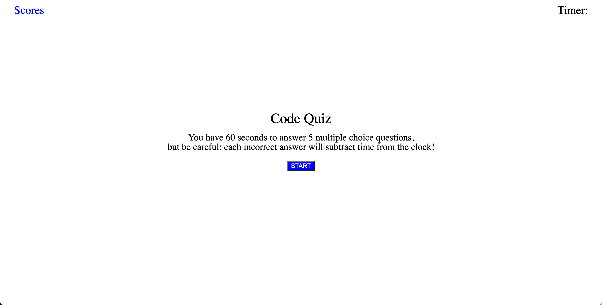

# Code Quiz

## Description and Usage

This application allows the user to navigate through a timed coding quiz of multiple choice questions. The quiz begins once the start button is clicked. The timer will begin countdown, and the user will have 60 seconds to complete the quiz. However, if the user gets an answer incorrect, the timer will subtract 5 seconds off the clock. At the end of the quiz, the user can save his or her score and view their previously saved scores by clicking the "Scores" option in the top left corner.

The following link leads to the deployed application.

https://miamauro.github.io/code-quiz/

The following image shows a screenshot of the deployed application.

